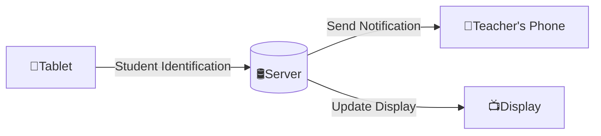
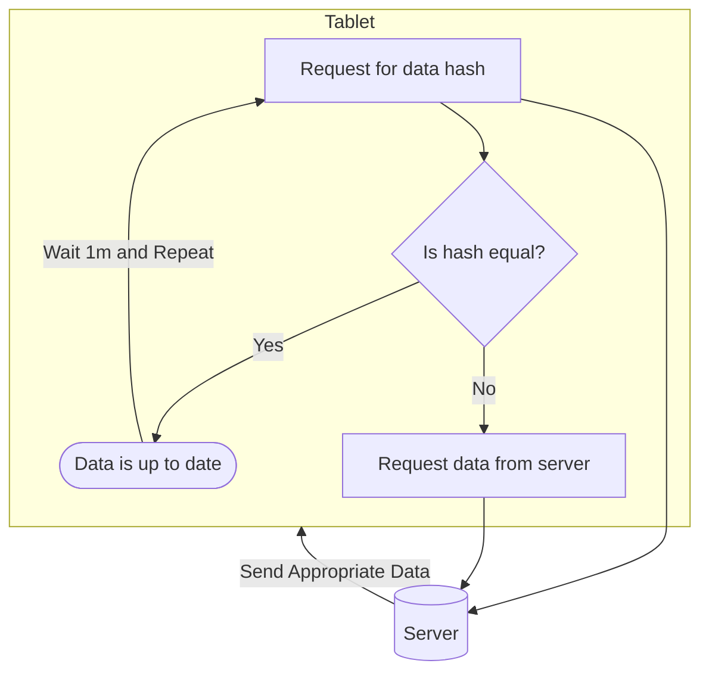

# Sending Notification From Tablet / Kiosk / Digital Doorbell

```mermaid
flowchart LR
	A["🔢Tablet"]
	B[("🛢️Server")]
	C["📺Display"]
	D["📱Teacher's Phone"]
	
	A -- Student Identification --> B
	B -- Send Notification --> D
	B -- Update Display --> C
```
# Updating Information 

```mermaid
flowchart TD
	subgraph Tablet
	requestHash[Request for data hash] --> hasData{Is hash equal?}
	hasData -- Yes --> done([Data is up to date])
	hasData -- No --> requestDat[Request data from server]
	done -- Wait 1m and Repeat --> requestHash
	end
	
	requestHash & requestDat --> S[("Server")]
	S -- Send Appropriate Data --> Tablet
```
