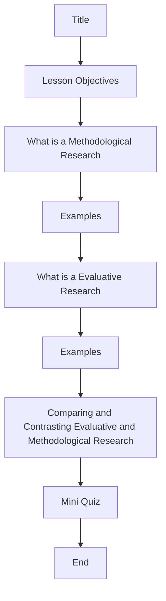
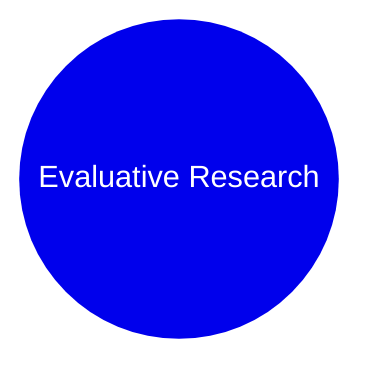

```mermaid
flowchart TD
	_["Title"] --> LO["Lesson Objectives"] --> A["What is a Methodological Research"] --> ExA["Examples"] --> B["What is a Evaluative Research"] --> ExB["Examples"] --> Comp["Comparing and Contrasting Evaluative and Methodological Research"] --> E["Mini Quiz"] --> ED["End"]
```

```mermaid
mindmap
	root((Evaluative Research))
		
```